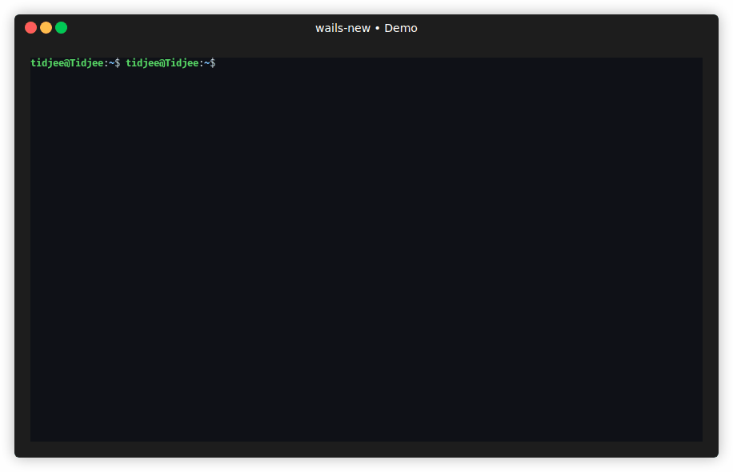

# wails-new

| Documentation                                                                                                                     | Tech Stack                                                                                                                                                                                                                                                                                                                                                                                                                                                                                                                                                                                                                                                                                                                                                                         |
| --------------------------------------------------------------------------------------------------------------------------------- | ---------------------------------------------------------------------------------------------------------------------------------------------------------------------------------------------------------------------------------------------------------------------------------------------------------------------------------------------------------------------------------------------------------------------------------------------------------------------------------------------------------------------------------------------------------------------------------------------------------------------------------------------------------------------------------------------------------------------------------------------------------------------------------- |
| [](https://tidjee-dev.github.io/wails-new) | [](https://go.dev) [](https://wails.io) [](https://vitejs.dev) [](https://svelte.dev) [](https://tailwindcss.com) [](https://www.typescriptlang.org) [](https://biomejs.dev) |

⚡ **Instantly bootstrap a modern Wails desktop app** with **Svelte 5**, **Vite**, and **Tailwind CSS 4**.



No manual setup. No boilerplate fatigue. Just code.

## Overview

`wails-new` is a CLI scaffolding tool for generating Wails applications with a
modern frontend stack based on **Vite**, **Svelte 5**, and **Tailwind CSS 4**.

It replaces the default Wails frontend with a clean, minimal, and
production-oriented setup in seconds.

## What You Get

- Go backend powered by **Wails**
- Vite-powered frontend
- **Svelte 5** (JavaScript or TypeScript)
- **Tailwind CSS 4**
- Interactive or non-interactive CLI
- Minimal `biome.json` configuration adapt to Svelte

## Requirements

- Go v1.25
- Wails CLI v2
- Node.js v24 / npm v11
- Biome CLI (if using biome as formatter and linter)

## Installation

```bash
git clone https://github.com/tidjee-dev/wails-new.git
cd wails-new
go build -o wails-new
```

(Optional) Move binary to PATH:

```bash
mv wails-new /usr/local/bin/
```

## Usage

```bash
wails-new <project-name> [options]
```

Example:

```bash
wails-new my-app
```

## Options

### `--ts`

Use **Svelte 5 with TypeScript** for the frontend.

### `--non-interactive`

Run without prompts and accept default values.

### `--dry-run`

Print all commands without executing them.

## What the Tool Does

1. Checks required tools (`wails`, `npm`)
2. Runs `wails init`
3. Removes the default Wails frontend
4. Creates a Vite frontend using Svelte 5
5. Installs and configures Tailwind CSS 4
6. Injects predefined backend and frontend boilerplate files
7. Optionally starts `wails dev`

## Generated Project Stack

- **Backend**: Go + Wails
- **Frontend**: Vite + Svelte 5 (optional TypeScript)
- **Styling**: Tailwind CSS 4

## Philosophy

- Minimal over magical
- Explicit over implicit
- No hidden abstractions

This tool gives you a clean starting point — not a framework you must obey.

## License

[MIT License](./LICENSE)
